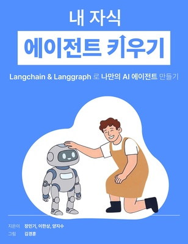

<div align="center">



# 내 자식 에이전트 키우기

LangChain & LangGraph v1으로 나만의 AI 에이전트를 만드는 책, 『내 자식 에이전트 키우기』의 실습 코드입니다.

지은이 장민기, 이한상, 양지수 / 그림 김경훈

[](https://www.python.org/downloads/)
[](LICENSE)
[](https://github.com/minkeymouse/raise-my-agent/actions/workflows/ci.yml)

</div>

## 시작하기

[uv](https://docs.astral.sh/uv/getting-started/installation/)를 설치한 뒤, 아래 명령으로 코드를 내려받고 모든 장의 패키지를 설치합니다.

```bash
git clone https://github.com/minkeymouse/raise-my-agent.git
cd raise-my-agent
uv sync
```

`.env.example`을 `.env`로 복사하고 `OPENAI_API_KEY` 등 필요한 키를 입력합니다. 장마다 필요한 키는 각 예제 파일의 머리말에 적혀 있습니다.

```bash
cp .env.example .env
```

예제는 리포지토리 루트에서 실행합니다.

```bash
uv run python ch01_agent_birth/02_chat_model.py
```

## 장별 코드

| 폴더 | 장 |
|---|---|
| [ch00_getting_started](ch00_getting_started/) | 0장. 에이전트 입문 |
| [ch01_agent_birth](ch01_agent_birth/) | 1장. 에이전트의 탄생 |
| [ch02_first_steps](ch02_first_steps/) | 2장. 에이전트의 첫 걸음 |
| [ch03_interaction](ch03_interaction/) | 3장. 에이전트와의 상호작용 |
| [ch04_research_agent](ch04_research_agent/) | 4장. 스튜디오 실습 - 자료조사 에이전트 |
| [ch05_graph_blueprint](ch05_graph_blueprint/) | 5장. 에이전트 동작의 설계도 |
| [ch06_multi_agent_school](ch06_multi_agent_school/) | 6장. 에이전트, 학교 가다 - 멀티 에이전트 1 |
| [ch07_orchestration](ch07_orchestration/) | 7장. 지휘봉을 든 에이전트 — 멀티 에이전트 2 (Orchestration) |
| [ch08_knowledge_base](ch08_knowledge_base/) | 8장. 에이전트 수능 공부 시키기 - 지식베이스 |
| [ch09_mcp](ch09_mcp/) | 9장. MCP - 에이전트의 사회적 성장과 확장 |
| [ch10_intern_agent](ch10_intern_agent/) | 10장. 스튜디오 실습 - 인턴 에이전트 |

## 코드 읽는 법

- 파일 이름 앞의 숫자는 책의 절 번호입니다. 예를 들어 `ch01_agent_birth/02_chat_model.py`는 1장 2절의 코드입니다.
- 각 파일의 머리말에 그 절에서 배우는 내용, 실행 방법, 필요한 키가 있습니다. 코드는 책의 소제목을 따라 `# %%` 셀로 나뉘어 있어 VS Code나 PyCharm에서 셀 단위로 실행할 수 있습니다.
- 4장과 10장은 LangGraph Studio 실습입니다. 해당 폴더로 이동해 `uv run langgraph dev`를 실행합니다.
- 코드는 책의 코드를 그대로 옮겼고, 책과 다른 곳에는 표시를 붙였습니다.
  - `[보충]` 파일 하나만으로 실행되도록 더한 코드
  - `[수정]` 책의 코드가 실행되지 않아 고친 곳 (책의 원래 코드는 옆 주석에 남겨 두었습니다)
  - `[설명용 코드]` 개념 설명을 위한 조각이라 주석으로 둔 코드
  - `[책의 실행 결과]` 책에 실린 실행 결과 (LLM의 답변은 실행할 때마다 달라질 수 있습니다)
- 8장의 `data/` 폴더에는 소설 세 편(이상 《날개》, 김유정 《동백꽃》, 현진건 《운수 좋은 날》)만 들어 있습니다. 수능 기출 문항은 포함하지 않았으며, 준비 방법은 `ch08_knowledge_base/chapter8/exam_agent.py`의 머리말에 있습니다.

## 오류 제보

코드가 실행되지 않거나 책과 다른 부분을 발견하면 [GitHub Issues](https://github.com/minkeymouse/raise-my-agent/issues)에 장과 절 번호, 실행한 명령, 오류 메시지를 함께 남겨 주세요. API 키는 절대 붙여 넣지 마세요.

## 라이선스

[Apache License 2.0](LICENSE)
